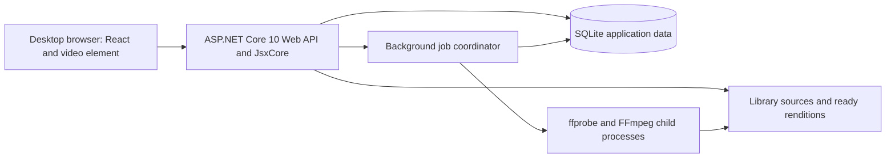

# Architecture and repository layout

## System shape

Use a single deployable ASP.NET Core 10 application. It hosts controller-based Web API endpoints, React UI through JsxCore, seekable media delivery, and a durable background preparation worker. SQLite holds application data. The filesystem holds sources, permanent outputs, and evictable quality outputs. No separate JavaScript development server, cloud dependency, distributed broker, or second backend is required for normal operation.



The diagrams describe intended design, not existing components.

## Future repository layout

```text
tutsvideoplayer/
├── TutsVideoPlayer.slnx
├── docs/
│   ├── README.md
│   ├── CONTEXT.md
│   ├── product/
│   ├── prd/
│   ├── adr/
│   ├── design/
│   ├── implementation/
│   └── operations/
└── src/
    ├── global.json
    ├── Directory.Build.props
    ├── Directory.Packages.props
    ├── .config/dotnet-tools.json
    ├── TutsVideoPlayer.Core/
    │   ├── TutsVideoPlayer.Core.csproj
    │   ├── Catalog/
    │   ├── Learning/
    │   └── Preparation/
    ├── TutsVideoPlayer.Infrastructure/
    │   ├── TutsVideoPlayer.Infrastructure.csproj
    │   ├── Persistence/Configurations/
    │   ├── Persistence/Migrations/
    │   ├── FileSystem/
    │   ├── Media/
    │   └── Transfer/
    ├── TutsVideoPlayer.Web/
    │   ├── TutsVideoPlayer.Web.csproj
    │   ├── Program.cs
    │   ├── Features/
    │   │   ├── Library/
    │   │   ├── Learning/
    │   │   ├── Playback/
    │   │   ├── Preparation/
    │   │   ├── Subtitles/
    │   │   └── Settings/
│   ├── Hosting/
│   ├── Views/                  # JsxCore TSX entry views
│   ├── Client/                 # React components, hooks, styles
│   └── wwwroot/                # bundled public assets only
│   ├── Tests/
│   │   ├── TutsVideoPlayer.Core.Tests/
│   │   ├── TutsVideoPlayer.IntegrationTests/
│   │   └── TutsVideoPlayer.BrowserTests/
│   ├── deploy/
│   │   ├── Dockerfile
│   │   └── compose.yaml
│   └── scripts/
```

This tree is a planned layout, not permission to create scaffolding now. All project and code files, including tests and deployment scripts, stay within `src`. The root `.slnx` references projects beneath it. Run SDK-sensitive build commands from `src` so its `global.json` participates in SDK selection; use `../TutsVideoPlayer.slnx` as the solution argument. Validate this convention in the build instructions and container context rather than moving project files to the root.

## Dependencies and responsibilities

| Component | Owns | May depend on |
| --- | --- | --- |
| Core | Lesson/source identity rules, progress behavior, job transitions, quality policy value objects | BCL only |
| Infrastructure | EF mappings/context/migrations, safe path resolution, file provenance, media subprocess adapters, export serialization | Core, EF Core SQLite, platform APIs |
| Web feature handlers | Use cases, DTO projections, transactions, orchestration, API validation | Core and Infrastructure |
| Web controllers | Routing, binding, response status, ProblemDetails | Feature handlers |
| React client | Presentation, navigation state, browser player lifecycle, API interaction | JsxCore React runtime and browser APIs |
| Hosted worker | Durable queue polling/claiming, scoped orchestration, cancellation | Core and Infrastructure through short-lived scopes |

This is a modular single application, not a strict four-layer Clean Architecture template. Application orchestration lives in cohesive Web features and can use the concrete EF context. Domain state transitions stay inside focused domain objects. Do not add a generic repository, another unit-of-work, mediator, message bus, or a project per feature by default. See [ADR 0003](../adr/0003-sqlite-and-focused-domain-model.md).

## ASP.NET composition

Use `WebApplicationBuilder`/`WebApplication`. Register controllers with `[ApiController]` behavior, ProblemDetails and centralized exception handling, typed options validation, EF Core SQLite, JsxCore, a background worker, and health endpoints. Keep `Program.cs` as a readable composition root and extract focused registration extensions only when they clarify ownership.

Use `ControllerBase` for JSON endpoints and the JsxCore-documented view adapter for HTML entry routes. Keep JSON under `/api/v1`; keep media endpoints distinct from document routes. Do not mix Minimal API and controller styles inside product features. Small infrastructure health mappings are acceptable.

Request sequence: allowed-host/connection policy, production-safe error handling, request correlation, routing, same-origin mutation protection, bounded mutation rate limits, and mapped API/UI/media endpoints. Only add forwarded-header handling when a known local proxy is actually configured. Default HTTP on loopback or the configured trusted LAN avoids assuming certificates exist; do not enable unconditional HTTPS redirection without a working HTTPS listener.

Serve UI assets using the pinned JsxCore production asset workflow. Keep the external library outside `wwwroot`. UI route fallback must not turn `/api`, `/media`, missing assets, or unknown JSON routes into HTML success responses. Unknown API routes return appropriate HTTP errors.

No authentication middleware or Identity schema is required. Still restrict unsafe browser actions to intended same-origin requests, explicit allowed hosts, and the configured network boundary. Cross-origin CORS is unnecessary for a same-origin client. CORS alone is not a mutation-protection mechanism. Detailed handling appears in [API](api.md) and [runbook](../operations/runbook.md).

## JsxCore integration contract

Select actual React with the project's documented `JsxCoreFramework` setting. Use TSX for typed React components; the user's React choice does not require untyped `.jsx`. Keep interactive video behavior client-side. Use C# DTOs and the JsxCore-supported type-generation workflow where verified; never generate client contracts directly from EF entities.

The integration spike must establish the exact entry-view conventions, React version, import resolution, production build outputs, local asset bundling, and Linux publish behavior of the pinned JsxCore package. Avoid inventing unverified registration APIs in advance. Confirm direct navigation to a lesson route returns the application shell, then React fetches same-origin data. A small server-rendered shell is acceptable; player state must not depend on server-side browser APIs.

Do not silently replace JsxCore with Vite, Blazor, or ReactJS.NET if a component import fails. Prefer a native video element and small local React controls to minimize package compatibility risk. JsxCore documents API-plus-view hosting and selectable React; this design chooses that pattern. [Official integration guide](https://github.com/davidwhitney/JsxCore/blob/main/docs/views-and-web-apis.md), [runtime selection](https://github.com/davidwhitney/JsxCore/blob/main/docs/runtimes.md).

## Concurrency and lifetime rules

- Request contexts are scoped; no DbContext is shared among parallel tasks.
- The singleton hosted service creates a fresh scope/context for each bounded database operation. It never retains a transaction during FFmpeg execution.
- A database job record is durable truth; an in-memory wake-up signal only reduces latency.
- A single installation lock prevents a second process using the same application data from starting normal work.
- Limit conversion concurrency to one. Probe concurrency starts at one or two and is measured against disk pressure. Playback delivery does not acquire the encoder semaphore.
- Respect cancellation for requests, enumeration, child-process waits, and shutdown. A disconnected request does not cancel an already accepted durable preparation job.

## Backend status to UI

Start with bounded polling: every two seconds while relevant jobs/scans are active and the page is visible, backing off when idle or hidden. Progress acknowledgements have their own ten-second playback cadence. Use request cancellation and revisions to avoid stale responses. SignalR is unnecessary initially; add push only if measured UX or load requires it.

## Build and package policy

Target `net10.0`, nullable enabled, implicit usings, centrally managed stable dependencies, and an SDK version pinned during implementation. Match EF runtime, design package, and dotnet-ef major versions. Commit migrations as source. Do not adopt preview .NET, Native AOT, trimming, or speculative compiled-query optimization.

External fonts/scripts must be bundled locally for runtime offline use. Keep FFmpeg version and codec availability in diagnostics; software encoding is the baseline on both platforms. Reproducible restore/build and actual Linux playback are release requirements, not assumptions based on a Mac build.
