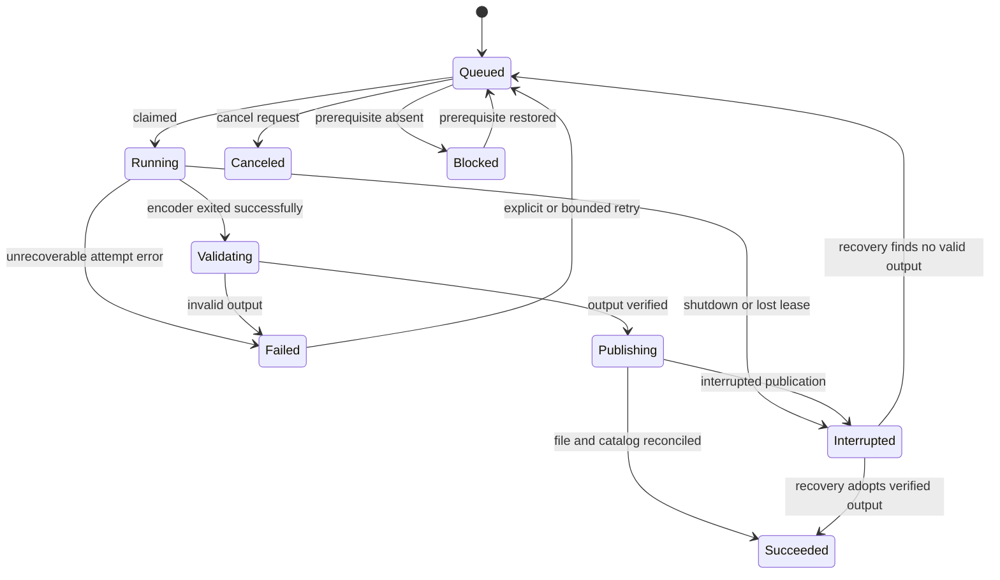

# Domain model and invariants

Use the [glossary](../CONTEXT.md) as canonical vocabulary. This document contains implementation modeling deliberately excluded from that glossary.

## Boundaries

There is one personal-learning domain with three collaborating areas: Catalog, Learning, and Preparation. They share stable lesson identifiers but do not form one giant Library aggregate. Reading a course tree must never load every source, subtitle, progress history, and job into a single tracked object graph.

| Model | Boundary and behavior | Persistence approach |
| --- | --- | --- |
| Library, Course, LessonFolder | Catalog records and hierarchy validation | Simple EF records and projections |
| Lesson | Identity, source generation, availability; associates its source components | Focused entity; no ownership of all progress/jobs |
| SourceComponent | Video or companion audio belonging to a lesson source set | Dependent entity of the lesson source representation |
| LessonProgress | One lesson's resume ownership, acknowledged sequence, automatic/manual completion | Small aggregate with intentful methods |
| PreparationJob | One rendition request, attempt, lease, and allowed lifecycle | Small aggregate with intentful methods |
| Rendition | Managed output identity, provenance, state, and retention class | Independent entity coordinated by job publication |
| SubtitleTrack / association | Discovered timed text and a chosen lesson relationship | Catalog records; explicit association validation |
| Preferences | Installation-wide choices | Simple settings; no events or elaborate aggregate |

LessonProgress and PreparationJob protect actual invariants. Settings and course summaries do not need ceremonial domain methods or events. The EF context is the persistence mechanism and transaction boundary; no repositories for child entities or generic CRUD façade are planned.

## IDs and value objects

Use typed IDs at C# domain boundaries for LibraryId, CourseId, LessonId, RenditionId, JobId, and SubtitleTrackId to prevent accidental interchange. Serialize opaque IDs as strings in APIs. Value objects are immutable and validate their semantics: `RelativeMediaPath`, `SourceSetFingerprint`, `PlaybackPosition`, `PlaybackSpeed`, `PixelDimensions`, `QualityProfile`, and `CacheByteLimit`.

`RelativeMediaPath` is relative, has no root/drive, contains no traversal segments, and is resolved against the host-configured library root. It is not proof that a symlink is safe; filesystem containment is an infrastructure responsibility. Preserve raw filesystem spelling. Separate search normalization from the path used to open a file.

`SourceSetFingerprint` covers the video and all required companion audio, including their roles and complete content digests when established. A changed companion audio invalidates the set just as a changed video does. Size and modification time are inexpensive change hints, not cryptographic proof. Unknown fingerprints are explicit, not represented as a hash of an empty value.

`PlaybackPosition` is finite and nonnegative; clamp to a known duration at the application boundary after validating range. `PlaybackSpeed` is one of 0.5, 0.75, 1, 1.25, 1.5, 1.75, or 2 for v1. `QualityProfile` describes actual dimensions and output recipe, not a promise to upscale to its label.

## Lesson identity

Initial catalog identity uses persistent generated IDs and exact library-relative source paths. During a stable scan, reuse IDs for unchanged source metadata. Before producing a managed rendition, calculate the complete source-set fingerprint and write it into provenance. Before exporting progress, resolve missing fingerprints for watched lessons so transfer does not rely solely on path.

For changed metadata at an existing path, probe and fingerprint the candidate. If content is unchanged, refresh metadata and preserve identity. If content differs, create a new source generation and flag progress for review; do not quietly apply old completion to a replacement video. Keep old progress available for explicit restoration. A conversion is current only for its source generation and compatible recipe.

A root path change with the same relative paths can retain library identity. A renamed/moved lesson can be reconciled automatically only when there is a single full-fingerprint match to a previously missing lesson and no competing active source identity. If two identical files exist in two courses, they remain two lessons. A matching digest is evidence of content equivalence, not a license to merge distinct course positions.

Managed output sidecars help restore identities after database loss. Sidecars are validated as untrusted library input. Duplicate lesson IDs discovered at incompatible paths are reported as identity conflicts, not allowed to overwrite another record.

## Learning state transitions

LessonProgress exposes intentful operations: start/take over session, record position, record ended, set manual completion, and restore automatic completion. A position command carries the current session and increasing sequence. The aggregate rejects stale ownership and duplicate/out-of-order writes without increasing its revision.

Effective completion is manual choice when present, otherwise the automatic flag. Maximum observed position may be retained for diagnostics, but the current resume position can move backward. Watching from the start after completion does not silently clear a deliberate completed status. Opening a completed lesson offers replay from zero.

Course completion is derived from available lesson completion. Include a separate missing-count indicator so removing a file does not misleadingly imply an unfinished course became fully watched. Do not persist a Course aggregate solely to maintain a counter that a query can derive.

## Preparation state machine

Queue pause is a persisted coordinator setting, not a separate state applied to every row. It prevents claims while allowing the current encode to finish. Each job has a deduplication key based on lesson, source generation, rendition purpose, and recipe. Duplicate commands return the existing job. A stale-source job cannot publish for the current source generation.

Priority order: selected-lesson compatibility work; selected requested quality; explicit course quality preparation; automatic compatibility backlog. Within a priority, order by enqueue time then job ID. Raising priority never kills an active encode. Source refresh during work blocks publication until source identity is revalidated.

## Cross-boundary coordination

Catalog discovery and job scheduling are eventually consistent: after a scan commits a lesson, an idempotent scheduler finds missing required compatibility jobs. This survives a crash between discovery and scheduling without a broker. Job publication and Rendition readiness are likewise reconciled using durable job/manifest state because filesystem and SQLite cannot share a transaction.

Optional domain events such as LessonCompleted or RenditionPrepared may feed UI invalidation after persistence. They must not be the only way essential work happens; a lost in-memory event must not lose a job or output. No outbox is needed in v1 because there are no external subscribers and reconciliation handles required side effects. If future external integrations require reliable delivery, make that a separate ADR.

## Edge cases that define the model

| Scenario | Required interpretation |
| --- | --- |
| `lesson.wmv` and unrelated `lesson.mp4` already exist | Two candidate sources until provenance proves a relationship; never overwrite either |
| Video unchanged but `_audio.aac` replaced | New source-set fingerprint; previous rendition is stale |
| User manually marks incomplete while another tab ends playback | Manual choice wins |
| Cache eviction removes 720p | Lesson and progress remain; that quality can be prepared again |
| Permanent copy survives but original is missing | Offer the verified copy with missing-source status; retain history |
| Root is temporarily offline | Storage unavailable, not a successful scan of zero lessons |
| Original moved and two matching digests exist | Ambiguous relocation; no automatic progress merge |
| Sidecar exists without final output | Incomplete publication or deleted output; do not advertise ready |
| App restarts halfway through encoding | Queue resumes by restarting work; partial MP4 is not a rendition |

## Domain review rules

Keep Core free of EF, HTTP, filesystem probing, and React concerns. Keep aggregates small and setters non-public where invariants matter. Persist changed aggregate state as one short transaction; bulk updates must not bypass completion or job transition rules. Queries may project directly from persisted models without constructing aggregates. Avoid events for internal helper steps and avoid wrappers whose only purpose is renaming `SaveChangesAsync`.
